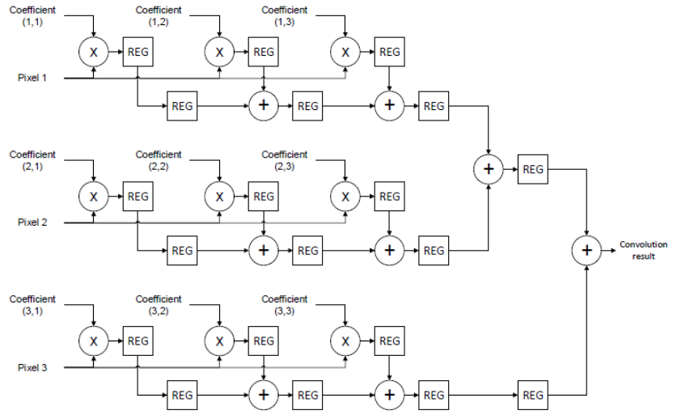
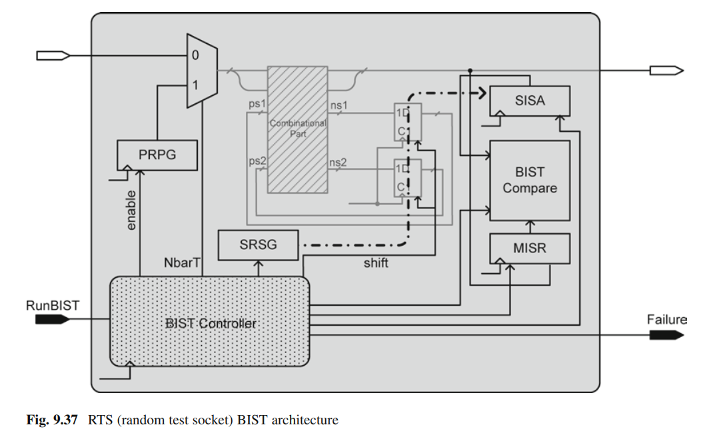
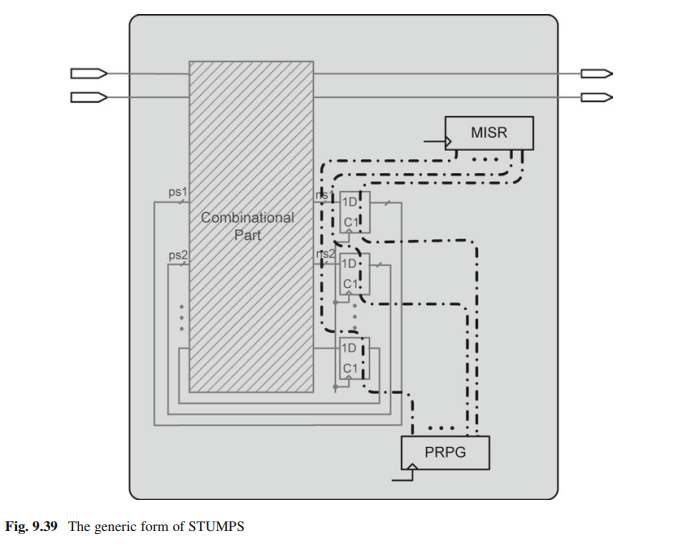

# 🔬 Built-In Self-Test (BIST) & DFT Architectures for 2D Pipelined CNN Convolver (STUMPS vs. RTS)

[](https://en.wikipedia.org/wiki/Verilog)
[-orange.svg)]()
[]()
[]()
[-green.svg)]()

This repository presents the complete RTL hardware design, gate-level scan insertion, and comparative analysis of two state-of-the-art **Built-In Self-Test (BIST)** architectures for a high-throughput **2D Pipelined CNN Convolution Core (Circuit Under Test - CUT)**:

1. **RTS BIST** (*Random Test Socket / Reseeded Dynamic Testing*)
2. **STUMPS BIST** (*Self-Testing Using MISR and Parallel SRSG*)

Both test architectures were designed in synthesizable **Verilog HDL**, synthesized into scan-stitched gate-level netlists, and validated through fault injection via Verilog PLI in ModelSim/QuestaSim, achieving **100% single stuck-at fault coverage**.

---

## 📌 Table of Contents
- [1. 2D Convolution & Circuit Under Test (CUT)](#1-2d-convolution--circuit-under-test-cut)
  - [A. Convolution Algorithm & Sliding Window](#a-convolution-algorithm--sliding-window)
  - [B. Non-Pipelined vs. Pipelined Architecture](#b-non-pipelined-vs-pipelined-architecture)
  - [C. Pipelined Datapath & Cycle-by-Cycle Operation](#c-pipelined-datapath--cycle-by-cycle-operation)
- [2. Design for Testability (DFT) & BIST Principles](#2-design-for-testability-dft--bist-principles)
- [3. BIST Architectures & Implementations](#3-bist-architectures--implementations)
  - [A. RTS (Random Test Socket) Architecture](#a-rts-random-test-socket-architecture)
  - [B. STUMPS Architecture](#b-stumps-architecture)
- [4. Finite State Machine (FSM) Test Controller](#4-finite-state-machine-fsm-test-controller)
- [5. Mathematical Formulations](#5-mathematical-formulations)
- [6. Experimental Results & Comparative Analysis](#6-experimental-results--comparative-analysis)
- [7. Repository File Structure](#7-repository-file-structure)
- [8. Simulation & Verification Guide](#8-simulation--verification-guide)
- [9. Author & License](#9-author--license)

---

## 1. 2D Convolution & Circuit Under Test (CUT)

### A. Convolution Algorithm & Sliding Window
Convolutional Neural Networks (CNNs) rely heavily on 2D spatial convolution for feature extraction in image processing. The 2D convolution operation filters an input image matrix using a smaller kernel matrix (weight filter).

A **sliding window** with dimensions matching the kernel ($3 \times 3$) traverses across the image matrix ($5 \times 5$). Starting from the top-left corner, it shifts column-by-column across each row, and then advances row-by-row to generate all receptive field windows (9 total sliding windows for a $5 \times 5$ image with a $3 \times 3$ kernel without padding).

### B. Non-Pipelined vs. Pipelined Architecture

#### 1. Non-Pipelined Architecture:
In a non-pipelined design, each sliding window sub-matrix is multiplied element-wise by the kernel matrix, and all intermediate products are summed simultaneously using a **Binary Tree Adder**:

$$
G = \sum_{i=0}^{m-1} \sum_{j=0}^{n-1} W(i, j) \cdot K(i, j)
$$

Where:
* $K$ represents the kernel weight matrix.
* $W$ represents the sliding window input matrix.
* $m$ and $n$ denote the number of rows and columns, respectively.

While functionally straightforward, this approach creates a large combinatorial critical path and requires 81 parallel multiplications with high fan-in adder trees, severely limiting operational clock frequency.

#### 2. Pipelined Architecture (Chosen CUT):
To maximize throughput and minimize the critical path delay, a **multi-stage pipelined systolic datapath** is implemented. Intermediate results are latched into pipeline registers across successive clock cycles.

---

### C. Pipelined Datapath & Cycle-by-Cycle Operation

The circuit datapath incorporates 9 parallel multiplier units, inter-stage pipeline registers, 3 row accumulator channels, and a 2-stage final adder tree:

<p align="center">
  
</p>

The cycle-by-cycle execution operates as follows:
* **Clock Cycle 1:** Multiplies the first column of kernel coefficients with the first column of image pixels across each row (`Pixel_1 × Coeff_11`, `Pixel_2 × Coeff_21`, `Pixel_3 × Coeff_31`) and latches the products into stage-1 registers.
* **Clock Cycle 2:** Multiplies the second column coefficients with the second column pixels (`Pixel_1 × Coeff_12`, `Pixel_2 × Coeff_22`, `Pixel_3 × Coeff_32`) and accumulates them with the registered previous products.
* **Clock Cycle 3:** Multiplies the third column coefficients with the third column pixels (`Pixel_1 × Coeff_13`, `Pixel_2 × Coeff_23`, `Pixel_3 × Coeff_33`), completing all three row-wise dot-products in parallel (`row1_final`, `row2_final`, `row3_final`).
* **Clock Cycle 4:** Sums the accumulated results of Row 1 and Row 2.
* **Clock Cycle 5:** Adds the intermediate combined sum (`Row 1` + `Row 2`) with the accumulated result of Row 3.
* **Clock Cycle 6:** The final 2D convolution value is registered, and the `valid_out` handshake signal is asserted.

---

## 2. Design for Testability (DFT) & BIST Principles

As deep-submicron VLSI complexity grows, external Automatic Test Equipment (ATE) costs increase dramatically. **Built-In Self-Test (BIST)** embeds test generation and response analysis directly on-chip, offering two major advantages:

1. **Enhanced Controllability:** The ability to establish specific logic states at internal circuit nodes using on-chip pattern generators.
2. **Enhanced Observability:** The ability to propagate and observe internal circuit states at primary outputs or compactors.

---

## 3. BIST Architectures & Implementations

### A. RTS (Random Test Socket) Architecture
The RTS BIST architecture provides targeted controllability and observability for sequential circuits with internal scan chains:

<p align="center">
  
</p>

* **PRPG (Pseudo-Random Pattern Generator):** An autonomous LFSR generating pseudo-random test vectors for primary inputs.
* **SRSG (Shift Register Sequence Generator):** Shifts serial test patterns into the internal scan chain.
* **MISR (Multiple-Input Signature Register):** Compresses primary output responses into a compact multi-bit signature.
* **SISA (Single-Input Signature Analyzer):** Compresses the serial scan-out chain responses.
* **RTS Controller:** Manages shifting, capture cycles, and signature comparison against pre-computed golden values.

---

### B. STUMPS Architecture
The STUMPS (*Self-Testing Using MISR and Parallel SRSG*) architecture resolves the test time bottleneck of serial scan chains:

<p align="center">
  
</p>

* **Parallel Scan Chains:** Partitions internal flip-flops into multiple balanced parallel scan chains (maximum length $L_{max} = 14$ flip-flops in this implementation).
* **Parallel PRPG / Phase Shifter:** An LFSR feeds all parallel scan inputs simultaneously with de-correlated pseudo-random sequences.
* **Parallel MISR Compaction:** All parallel scan outputs feed into a multi-input MISR simultaneously.
* **Throughput Benefit:** Reduces shift cycles per pattern from $\approx 40$ down to **14 clock cycles**, speeding up the test routine by over **$2.8\times$**.

---

## 4. Finite State Machine (FSM) Test Controller

The BIST controller finite state machine coordinates test sequence execution:

```
 ┌─────────┐
 │  RESET  │ ──► Initialize LFSR/MISR seeds and reset CUT
 └────┬────┘
      │
      ▼
 ┌─────────┐
 │ SCAN-IN │ ──► Shift pseudo-random patterns into internal scan chain(s)
 └────┬────┘     (RTS: ~40 cycles | STUMPS: 14 cycles)
      │
      ▼
 ┌─────────┐
 │ CAPTURE │ ──► Normal execution mode (NbarT=0) for 1 clock cycle to capture responses
 └────┬────┘
      │
      ▼
 ┌──────────────┐
 │ GEN_SIGNATURE│ ──► Shift responses into MISR/SISA for spatial & temporal compaction
 └────┬─────────┘
      │
      ▼
 ┌─────────┐
 │  DONE   │ ──► Assert `done` flag and compare final signature against Golden Signature
 └─────────┘
```

---

## 5. Mathematical Formulations

### 1. LFSR Characteristic Polynomial
The LFSRs and MISRs are governed by primitive characteristic polynomials over Galois Field $GF(2)$:

$$
P(x) = 1 + \sum_{i=1}^{n} c_i x^i, \quad c_i \in \{0, 1\}
$$

### 2. Signature Compaction (MISR)
The state of the $n$-bit MISR at clock cycle $t+1$ with parallel input vector $\mathbf{Z}(t) = [z_0(t), z_1(t), \dots, z_{n-1}(t)]$ is defined by:

$$
S(t+1) = \mathbf{T} \cdot S(t) \oplus \mathbf{Z}(t)
$$

Where $\mathbf{T}$ is the companion state-transition matrix.

The probability of aliasing (masking an error signature) for an $n$-bit MISR with test length $L \gg n$ asymptotically approaches:

$$
P_{\text{aliasing}} \approx \frac{1}{2^n}
$$

### 3. Fault Coverage Calculation
The single stuck-at fault coverage is defined as:

$$
\text{Fault Coverage (\%)} = \left( \frac{\text{Number of Detected Faults}}{\text{Total Collapsed Faults}} \right) \times 100\%
$$

---

## 6. Experimental Results & Comparative Analysis

### A. Fault Coverage Performance (Single Stuck-at Fault Model)

| Architecture | Seed / Configuration | Total Faults | Detected Faults | Fault Coverage (%) | Signature Status |
| :--- | :---: | :---: | :---: | :---: | :---: |
| **RTS BIST** | Config #1 | 356 | 356 | **100.00%** | ✅ Golden Match |
| **RTS BIST** | Config #2 | 356 | 356 | **100.00%** | ✅ Golden Match |
| **RTS BIST** | Config #3 | 356 | 356 | **100.00%** | ✅ Golden Match |
| **STUMPS BIST** | Config #1 | 356 | 356 | **100.00%** | ✅ Golden Match |
| **STUMPS BIST** | Config #2 | 356 | 356 | **100.00%** | ✅ Golden Match |
| **STUMPS BIST** | Config #3 | 356 | 355 | **99.72%** | ✅ Golden Match |

### B. RTS vs. STUMPS Architecture Comparison

| Metric | RTS Architecture | STUMPS Architecture | Architectural Advantage |
| :--- | :---: | :---: | :---: |
| **Scan Chain Topology** | Single Serial Chain | Parallel Multi-Chains ($K$ chains) | Lower shift latency |
| **Shift Cycles per Pattern** | $\approx 40\text{ cycles}$ | **$14\text{ cycles}$** | **$2.85\times$ Speedup** |
| **Response Compactor** | SISA + MISR | Parallel Multi-Input MISR | Unified compaction |
| **Fault Coverage** | $100.0\%$ | $100.0\%$ | Equal high defect detection |
| **Overall Test Time** | Baseline ($1.0\times$) | **$< 0.40\times$ baseline** | **$> 60\%$ TAT Reduction** |

---

## 7. Repository File Structure

```text
.
├── .gitignore
├── README.md
├── docs/
│   └── images/                     # Architecture diagrams and schematics
│       ├── pipelined_convolver_datapath.png
│       ├── rts_bist_architecture.png
│       └── stumps_bist_architecture.png
├── RTS/
│   ├── RTS_Architecture.v          # Top-level RTS BIST wrapper and test harness
│   ├── RTS_Controller.v            # RTS BIST finite state machine controller
│   ├── RTS_modules.v               # PRPG, SRSG, SISA, MISR hardware modules
│   ├── top_convolver_net.v         # Gate-level netlist of the 2D Convolver CUT
│   ├── component_library.v         # Standard cell library models for netlist simulation
│   ├── convolver.v                 # Behavioral 2D Convolver reference model
│   ├── convolver_tb.v              # Functional verification testbench
│   ├── Configuration.txt           # Polynomial and seed configuration vectors
│   ├── Signature.txt               # Golden signature reference values
│   └── Result.txt                  # Fault simulation logs and coverage report
└── STUMPS/
    ├── STUMPS_Architecture.v       # Top-level STUMPS BIST wrapper
    ├── STUMPS_controller.v         # STUMPS multi-chain BIST controller FSM
    ├── netlist_top_convolver_stumps.v # Scan-stitched multi-chain netlist
    ├── Configuration.txt           # Multi-chain seed and polynomial configurations
    ├── Signature.txt               # STUMPS golden signature log
    └── Result.txt                  # STUMPS fault simulation and coverage logs
```

---

## 8. Simulation & Verification Guide

### Prerequisites
* Mentor Graphics **ModelSim** or Siemens **QuestaSim** with Verilog PLI support.

### Running RTS BIST Simulation:
```tcl
# Navigate to the RTS directory
cd RTS

# Create work library and compile sources
vlib work
vlog component_library.v convolver.v top_convolver_net.v RTS_modules.v RTS_Controller.v RTS_Architecture.v

# Run simulation with fault injection PLI
vsim -pli faultInjection.dll work.RTS_Architecture
run -all
```

### Running STUMPS BIST Simulation:
```tcl
# Navigate to the STUMPS directory
cd STUMPS

# Create work library and compile sources
vlib work
vlog ../RTS/component_library.v ../RTS/convolver.v netlist_top_convolver_stumps.v ../RTS/RTS_modules.v STUMPS_controller.v STUMPS_Architecture.v

# Run simulation
vsim -pli ../RTS/faultInjection.dll work.STUMPS_Architecture
run -all
```

---

## 9. Author & License

* **Author:** Fateme Ghafel Khasraji
* **Field:** Hardware Acceleration, Digital RTL Design, SoC Architectures & DFT
* **License:** This project is licensed under the [MIT License](LICENSE).
